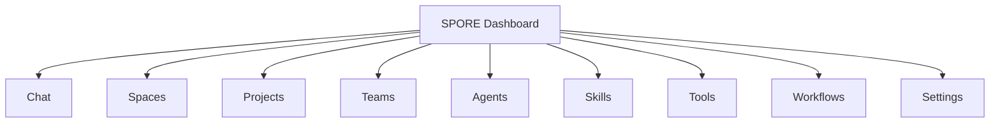
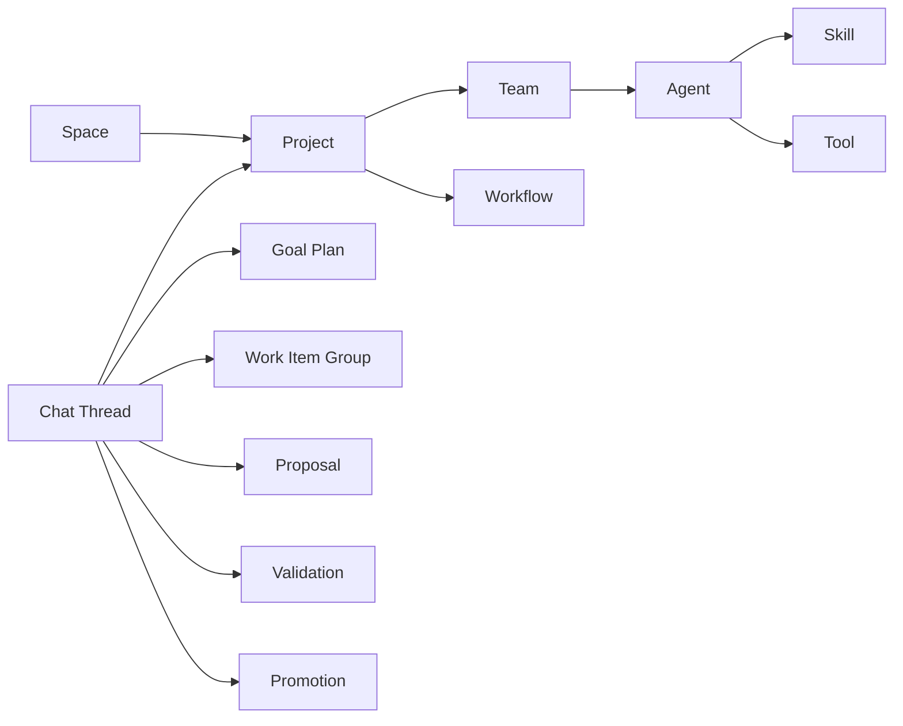
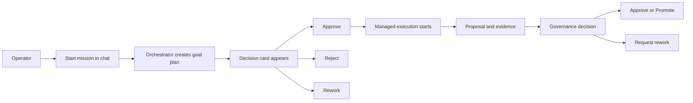

# SPORE Dashboard Rebuild Agent Prompt

Use the following prompt with the external application or agent that will design and build the new SPORE dashboard.

---

## Ready-To-Use Prompt

```md
You are designing a new dashboard for SPORE.

SPORE means: Swarm Protocol for Orchestration, Rituals & Execution.

This is not a generic project dashboard. It is a control plane for a governed multi-agent software delivery system. The dashboard must help an operator understand, steer, approve, reject, inspect, and configure the entire system from one place.

The current dashboard exists, but it is only an example surface and is not user-friendly enough. Your task is to redesign the dashboard from scratch as a coherent, operator-grade product. The result should feel intentional, calm, readable, and powerful rather than experimental, cluttered, or developer-only.

## Product Context

SPORE is a modular, documentation-first orchestration platform for supervised multi-agent software delivery and self-build workflows.

The system already has durable backend concepts and orchestrator-owned state. The new dashboard must respect those boundaries.

Important architectural principle:

- the orchestrator is the source of truth for workflow and operator-facing state,
- durable artifacts remain authoritative,
- the dashboard is a thin but excellent control surface over orchestrator APIs,
- the UI must not invent its own hidden workflow state machine.

The existing SPORE architecture includes concepts such as:

- operator threads and chat messages,
- pending actions and governance decisions,
- goal plans,
- work-item groups,
- work items and work-item runs,
- proposal artifacts,
- validation results,
- promotion and integration flows,
- projects,
- teams,
- profiles/agents,
- skills,
- tools,
- workflows,
- policy packs,
- workspaces and execution surfaces.

The dashboard should expose these concepts in a human-friendly way without flattening them into a boring CRUD admin panel.

## Core Product Goal

Design a new SPORE dashboard that allows an operator to control the whole system.

The first and most important page is the chat with the orchestrator.

That chat is the primary operating surface.

The orchestrator acts as the central system manager across projects and system workflows. The chat must therefore be:

- easy,
- clean,
- readable,
- pleasant,
- confidence-inspiring,
- suitable for both monitoring and action-taking.

## Primary UX Model

Use a control-plane model, not a generic SaaS dashboard model.

The structure should be:

1. Persistent left sidebar for global navigation.
2. Main content area that changes by section.
3. Home/default section = Orchestrator Chat.
4. Supporting pages for system entities and configuration.

The dashboard should feel like mission control for a supervised agentic system.

## Information Architecture

The left sidebar should contain at least these sections:

- Chat
- Spaces
- Projects
- Teams
- Agents
- Skills
- Tools
- Workflows
- Settings

You may add supporting secondary navigation inside pages, but the above is the required top-level structure.

## Domain Model To Reflect In The UI

### Spaces

Spaces are top-level containers.

- A space can contain one project or many projects.
- The operator must be able to create a space.
- The operator must be able to edit a space.
- The operator must be able to delete a space.
- The operator must be able to browse projects grouped by space.

### Projects

Projects are attached to spaces and represent repositories or managed delivery contexts where SPORE operates.

The UI must support:

- adding projects,
- removing projects,
- assigning a project to a space,
- viewing project status,
- viewing project repository metadata,
- connecting teams and workflows to a project,
- understanding what SPORE is currently doing for that project.

### Agents

Agents are configurable system actors.

The operator must be able to:

- create agents,
- name agents,
- add descriptions,
- assign skills,
- assign tools,
- inspect what the agent is intended to do,
- later attach agents into teams.

### Teams

Teams are groups of agents that can be attached to projects.

The UI must support:

- creating teams,
- naming teams,
- describing team purpose,
- assigning agents to teams,
- defining responsibilities or roles inside the team,
- attaching a team to one or more projects.

### Skills

Skills are reusable capabilities or behavioral packages that can be assigned to agents.

The UI must support:

- browsing available skills,
- understanding what each skill does,
- assigning skills to agents,
- identifying which agents and teams use a skill.

### Tools

Tools are executable capabilities available to agents.

The UI must support:

- browsing available tools,
- understanding tool purpose and restrictions,
- attaching tools to agents,
- seeing usage relationships between tools and agents.

### Workflows

Workflows describe how communication and execution pass between agents and system stages.

The UI must support:

- listing workflows,
- viewing workflow details,
- understanding step order,
- understanding handoffs between agents,
- seeing which workflows are attached to which projects or teams,
- making workflow relationships understandable visually.

### Settings

Settings should cover system-wide configuration, not just page preferences.

Infer a sensible settings model for SPORE, including categories such as:

- orchestrator defaults,
- approval and governance behavior,
- validation defaults,
- promotion and integration defaults,
- notification behavior,
- UI preferences,
- safety mode defaults,
- environment/infrastructure connections,
- audit and observability preferences.

Do not make Settings a junk drawer. It should be organized into clear groups with a reason for each one.

## Chat Requirements

The Chat page is the home page and the most important screen in the product.

Design it as an orchestrator mission console.

The chat must support:

- a clean message timeline,
- strong distinction between operator messages and orchestrator messages,
- rich orchestrator response cards,
- decision-focused interaction patterns,
- quick actions that are large and easy to click,
- excellent readability,
- easy scanning of current system state.

### Message Content Types

Messages from the orchestrator should be able to include cards that indicate what the orchestrator is talking about.

Examples include:

- goals,
- proposals,
- approvals,
- rejections,
- validation results,
- workflow state,
- warnings,
- blockers,
- next actions,
- project references,
- team or agent references.

These should not appear as raw JSON blobs or plain text dumps. They should appear as structured, visually distinct cards embedded in the conversation.

### Required Decision Actions

The interface must prominently support buttons such as:

- Approve
- Reject

You should also design for adjacent decision actions where appropriate, such as:

- Rework
- Hold
- Resume
- Promote
- Quarantine
- Release
- Open Details

Buttons must feel obvious, safe, and easy to use.

### Chat Layout Requirements

The chat page should include:

- conversation timeline,
- current mission/thread context,
- pending decisions,
- linked artifacts or related objects,
- quick actions,
- input composer.

It should be possible to understand, at a glance:

- what the orchestrator is currently doing,
- what needs operator attention now,
- what decision is pending,
- what artifacts are affected,
- what happens next after approval or rejection.

### Chat Behavior Principles

- The chat is not just messaging; it is an operating surface.
- The orchestrator should feel like a system controller, not a toy chatbot.
- The UI should favor clarity over novelty.
- The system should visually separate conversation, decisions, evidence, and durable linked artifacts.
- The page should handle dense operational information without becoming stressful.

## Dashboard Design Principles

Follow these principles:

### 1. Thin Client

Do not design the frontend as if it computes workflow truth itself.

Assume the backend provides authoritative data such as:

- thread summaries,
- inbox summaries,
- decision guidance,
- hero/progress/evidence projections,
- queue summaries,
- status badges,
- action choices,
- artifact references.

The frontend should render these elegantly and consistently.

### 2. Operator-First

Prioritize the needs of a human operator supervising a complex multi-agent system.

This means:

- clear hierarchy,
- obvious calls to action,
- low cognitive overload,
- visibility into state and consequences,
- confidence in approvals and rejections.

### 3. Clear Separation Of Concerns

The UI should make the following distinctions legible:

- conversational state,
- durable system records,
- execution state,
- governance state,
- configuration state.

### 4. Scalable Navigation

The IA should still work when there are:

- many spaces,
- many projects,
- many agents,
- many teams,
- many workflows,
- many active decisions.

### 5. Serious Product Tone

This should not look like a generic AI demo.

It should look like software for running a governed automation platform.

Avoid gimmicky chatbot aesthetics.

## Suggested Screen-Level Requirements

Design at least the following views:

### 1. Chat / Mission Control

The main operating page.

Include:

- thread list or mission list,
- active thread header,
- timeline,
- embedded cards,
- decision panel,
- quick-action buttons,
- linked artifact/context rail.

### 2. Spaces

Include:

- space list,
- create/edit/delete flow,
- project counts per space,
- health/status summary by space.

### 3. Projects

Include:

- project table or card grid,
- repository details,
- linked space,
- linked teams,
- active workflows,
- current system activity,
- add/remove project flows.

### 4. Teams

Include:

- team list,
- team detail,
- assigned agents,
- linked projects,
- team purpose and responsibility.

### 5. Agents

Include:

- agent catalog,
- agent creation/edit form,
- description,
- assigned skills,
- assigned tools,
- usage context,
- compatibility with teams.

### 6. Skills

Include:

- skill library,
- skill detail,
- description and capability summary,
- which agents use the skill.

### 7. Tools

Include:

- tool library,
- tool detail,
- restrictions/permissions,
- which agents use the tool.

### 8. Workflows

Include:

- workflow catalog,
- workflow detail,
- visual handoff map,
- linked agents or teams,
- linked projects,
- status/usage insights.

### 9. Settings

Include organized system settings groups, such as:

- General
- Orchestrator
- Governance
- Validation
- Promotion
- Notifications
- Environments
- Security/Safety
- Observability
- Interface Preferences

## Required Relationships To Make Visible

The dashboard must clearly reveal these relationships:

- Space -> Projects
- Project -> Teams
- Team -> Agents
- Agent -> Skills
- Agent -> Tools
- Project -> Workflows
- Workflow -> participating agents or roles
- Chat thread -> related project/artifacts/decisions

An operator should be able to move through those relationships without losing context.

## Visual Direction

Choose a visual language that communicates operational clarity and trust.

Requirements:

- modern and polished,
- elegant but not flashy,
- readable under dense information,
- strong spacing and hierarchy,
- clear status semantics,
- excellent button affordance,
- dashboard quality suitable for daily operations.

Avoid:

- generic AI chat app styling,
- shallow marketing-site aesthetics,
- overly playful visuals,
- cluttered enterprise tables everywhere,
- dark patterns or ambiguous destructive actions.

## Responsive Behavior

The product must work on desktop and mobile.

Desktop is the primary target, but mobile should still be usable for:

- checking status,
- reading orchestrator updates,
- approving or rejecting decisions,
- navigating core entities.

## Deliverables

Produce a high-quality dashboard concept and starter implementation plan including:

1. Information architecture
2. Sidebar/navigation structure
3. Main page layouts
4. Chat screen design
5. Entity management screens
6. State and relationship model for the UI
7. Component inventory
8. Design system direction
9. Responsive behavior notes
10. Clickable or implementation-ready page structure

## Important Non-Goals

Do not:

- reduce the product to a simple CRUD admin,
- reduce the product to only chat,
- invent backend workflow logic in the UI,
- hide critical decisions behind tiny controls,
- make the system feel like a toy chatbot,
- produce a bland template dashboard.

## Architecture Summary To Respect

Treat the following as true about SPORE:

- orchestrator-owned state is authoritative,
- operator chat is the primary control surface,
- goal plans, work-item groups, work-item runs, proposals, validations, and promotions are durable records,
- projects are attached to spaces,
- teams can be attached to projects,
- agents can be created and configured with skills and tools,
- workflows describe how work and communication move across the system,
- the UI must help the operator manage the whole system from one place.

## Mermaid Diagram: Primary Navigation



## Mermaid Diagram: Core Entity Relationships



## Mermaid Diagram: Mission Control Flow



## Final Instruction

Design this as the first serious operating system UI for SPORE.

The home page is the orchestrator chat, but the full product is a system control plane for spaces, projects, teams, agents, skills, tools, workflows, and global settings.

Every major page should feel connected to the same underlying orchestration model.
```

---

## Implementation Notes For Whoever Uses This Prompt

- Base the new dashboard on a control-plane UX, not on a generic chat app.
- Preserve the SPORE thin-client rule described in `docs/architecture/clients-and-surfaces.md`.
- Preserve the operator-chat direction described in `docs/plans/operator-chat-surface-plan.md`.
- Reflect the existing config model visible in `config/projects/spore.yaml`.
- Treat the current dashboard as context, not as a design constraint.

## Source Context Used

- `AGENTS.md`
- `docs/architecture/clients-and-surfaces.md`
- `docs/plans/operator-chat-surface-plan.md`
- `config/projects/spore.yaml`
