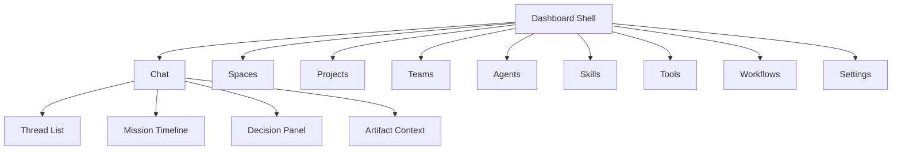
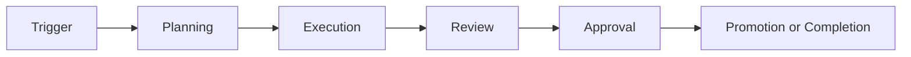
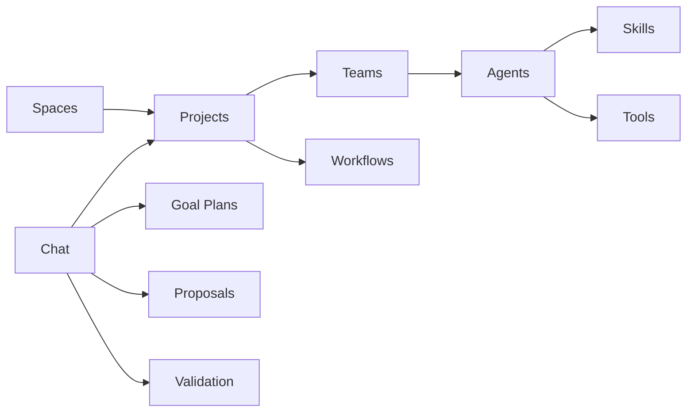

# SPORE Dashboard Wireframe Spec

This document complements `docs/dashboard-rebuild-agent-prompt.md` with a page-by-page wireframe-oriented specification for the new SPORE dashboard.

## Product Frame

- Product type: system control plane for SPORE
- Primary user: operator supervising orchestrator-driven work across spaces, projects, teams, agents, workflows, and governance states
- Primary entry point: `Chat`
- Interaction model: conversation-first control with surrounding management surfaces
- UX principle: thin client over orchestrator-owned state

## Global Shell

### Layout

- Far left: persistent app sidebar
- Top of content area: contextual page header
- Main center: page-specific primary content
- Optional right rail: context, details, pending actions, linked artifacts, or inspector

### Sidebar Structure

```text
-------------------------------------------------
| SPORE                                          |
| Search / command palette                       |
|----------------------------------------------- |
| Chat                                           |
| Spaces                                         |
| Projects                                       |
| Teams                                          |
| Agents                                         |
| Skills                                         |
| Tools                                          |
| Workflows                                      |
| Settings                                       |
|----------------------------------------------- |
| Active environment / profile                   |
| Notifications / inbox count                    |
| Operator identity                              |
-------------------------------------------------
```

### Global Behaviors

- Sidebar remains visible on desktop
- Sidebar collapses into drawer on mobile/tablet
- Global search can jump to projects, agents, workflows, threads, or settings sections
- Global inbox count highlights pending decisions needing operator action
- Status color system must distinguish governance states from failures

## Information Hierarchy



## Page 1: Chat / Mission Control

### Purpose

The operator's home screen. This is where the operator starts missions, reviews orchestrator output, sees pending decisions, and steers the system.

### Desktop Wireframe

```text
------------------------------------------------------------------------------------------------------
| Header: Chat / Mission Control         [Global Inbox] [New Mission] [Filters]                       |
|----------------------------------------------------------------------------------------------------|
| Thread List                    | Active Mission Timeline                         | Context Rail      |
|-------------------------------|-------------------------------------------------|------------------|
| Search threads                | Mission title                                   | Current state     |
| Inbox summary                 | Mission subtitle / project / space              | Pending actions   |
| Thread item                   |-------------------------------------------------| Linked artifacts  |
| Thread item                   | Hero card                                       | Goal plan         |
| Thread item                   | Progress strip                                  | Proposal          |
| Thread item                   |-------------------------------------------------| Validation        |
| Thread item                   | Message timeline                                | Project           |
|                               | - operator message                              | Workflow          |
|                               | - orchestrator rich card                        | Agent/team refs   |
|                               | - decision card with buttons                    | Activity summary  |
|                               | - evidence / warning / blocker card             |                  |
|                               |                                                 |                  |
|                               | Composer [message input......................]   |                  |
|                               | [Approve] [Reject] [Rework] [Hold] [Send]       |                  |
------------------------------------------------------------------------------------------------------
```

### Required Regions

- `Thread List`: active conversations, status badges, unread changes, pending action counts
- `Mission Header`: thread name, project, space, current stage, freshness
- `Hero Card`: concise orchestrator-authored summary of what is happening now
- `Progress Strip`: current lifecycle state with visible governance stops
- `Timeline`: readable sequence of conversation and structured cards
- `Decision Card`: clear statement of what decision is needed and its consequences
- `Context Rail`: always-visible links to the durable artifacts referenced in the active thread
- `Composer`: freeform operator message plus quick reply actions

### Chat Cards

The timeline must support these card types:

- Goal card
- Proposal card
- Approval request card
- Rejection / rework card
- Validation summary card
- Warning / blocker card
- Workflow stage card
- Artifact reference card
- Recommendation / next-action card

### Decision Buttons

- Large, high-contrast, easy to click
- Primary buttons shown inline inside decision cards
- Dangerous actions must be visually distinct
- Buttons should use explicit labels rather than ambiguous icons

### Mobile Behavior

- Thread list becomes slide-over panel
- Context rail becomes expandable bottom sheet or tab
- Primary decision buttons remain sticky near the composer when a decision is active

## Page 2: Spaces

### Purpose

Top-level organization for all SPORE-managed projects.

### Wireframe

```text
----------------------------------------------------------------------------------------------
| Header: Spaces                                  [Create Space] [Filter] [Sort]              |
|--------------------------------------------------------------------------------------------|
| Summary cards: total spaces | total projects | spaces with alerts | spaces with activity   |
|--------------------------------------------------------------------------------------------|
| Space List / Grid                                                                          |
| ------------------------------------------------------------------------------------------ |
| Space Card                                                                                 |
| Name                                                                                       |
| Description                                                                                |
| Project count                                                                              |
| Status summary                                                                             |
| Last activity                                                                              |
| [Open] [Edit] [Delete]                                                                     |
| ------------------------------------------------------------------------------------------ |
```

### Space Detail

- Header with space metadata
- List of projects inside the space
- Health summary across those projects
- Quick create project action

## Page 3: Projects

### Purpose

Manage repositories and active delivery contexts where SPORE operates.

### Wireframe

```text
--------------------------------------------------------------------------------------------------
| Header: Projects                               [Add Project] [Import Repo] [Filters]           |
|------------------------------------------------------------------------------------------------|
| Project table / card list                                                                       |
|------------------------------------------------------------------------------------------------|
| Name | Space | Repo | Teams | Active workflows | Current activity | Status | Actions          |
|------------------------------------------------------------------------------------------------|
| ...                                                                                             |
```

### Project Detail Layout

- `Overview` tab: status, space, repo metadata, last orchestrator activity
- `Teams` tab: attached teams and responsibilities
- `Workflows` tab: active/default workflows
- `Activity` tab: current work, pending approvals, recent proposals
- `Governance` tab: approval posture, validation defaults, promotion posture

### Key Actions

- Add project
- Remove project
- Change assigned space
- Attach or detach teams
- Attach or detach workflows
- Open related chat threads

## Page 4: Teams

### Purpose

Define reusable groups of agents attached to projects.

### Wireframe

```text
----------------------------------------------------------------------------------------------
| Header: Teams                                   [Create Team] [Filters]                     |
|--------------------------------------------------------------------------------------------|
| Team list                                                                                   |
|--------------------------------------------------------------------------------------------|
| Team name | Purpose | Agents count | Linked projects | Workflow coverage | Actions         |
```

### Team Detail

- Team purpose and description
- Agent roster
- Role/responsibility matrix
- Linked projects
- Linked workflows or recommended workflow fit

### Detail Subsections

- `Overview`
- `Agents`
- `Projects`
- `Responsibilities`

## Page 5: Agents

### Purpose

Create and configure the individual actors used across SPORE.

### Wireframe

```text
-------------------------------------------------------------------------------------------------
| Header: Agents                                  [Create Agent] [Filters] [Search]              |
|------------------------------------------------------------------------------------------------|
| Agent catalog                                                                                   |
|------------------------------------------------------------------------------------------------|
| Name | Description | Skills | Tools | Teams | Status | Actions                                |
```

### Agent Detail

- Agent identity and description
- Assigned skills
- Assigned tools
- Team memberships
- Usage footprint across projects/workflows
- Guardrails or permissions summary

### Agent Form

- Name
- Description
- Role/type
- Skills multi-select
- Tools multi-select
- Notes or intended purpose

## Page 6: Skills

### Purpose

Show reusable capabilities available across agents.

### Wireframe

```text
-----------------------------------------------------------------------------------------------
| Header: Skills                                  [Create Skill? optional] [Search]            |
|---------------------------------------------------------------------------------------------|
| Skill library                                                                                |
|---------------------------------------------------------------------------------------------|
| Skill | Category | Description | Used by agents | Used by teams | Actions                   |
```

### Skill Detail

- Description
- Intended use
- Linked agents
- Linked teams through those agents
- Related tools or workflows if relevant

## Page 7: Tools

### Purpose

Make agent tooling legible and manageable.

### Wireframe

```text
------------------------------------------------------------------------------------------------
| Header: Tools                                   [Register Tool? optional] [Search]           |
|----------------------------------------------------------------------------------------------|
| Tool list                                                                                     |
|----------------------------------------------------------------------------------------------|
| Tool | Purpose | Restrictions | Assigned agents | Risk level | Actions                       |
```

### Tool Detail

- Tool description
- Access restrictions
- Expected usage
- Assigned agents
- Relationship to workflows or project contexts

## Page 8: Workflows

### Purpose

Explain how work moves through the system.

### Wireframe

```text
-------------------------------------------------------------------------------------------------
| Header: Workflows                                [Create Workflow] [Filters] [Search]          |
|------------------------------------------------------------------------------------------------|
| Workflow catalog                                                                                 |
|------------------------------------------------------------------------------------------------|
| Workflow | Purpose | Stages | Projects using it | Teams using it | Last activity | Actions    |
```

### Workflow Detail

- Workflow metadata
- Stage list
- Handoff map
- Roles or agents involved
- Attached projects
- Usage notes and current status if active

### Workflow Visualization



### Desired Detail Layout

- Left column: workflow stages list
- Center: visual flow map
- Right rail: linked projects, linked teams, participating roles, recent runs

## Page 9: Settings

### Purpose

Central system-wide configuration.

### Settings Groups

- General
- Orchestrator
- Governance
- Validation
- Promotion
- Notifications
- Environments
- Security / Safety
- Observability
- Interface Preferences

### Wireframe

```text
-------------------------------------------------------------------------------------------------
| Header: Settings                                                                                |
|------------------------------------------------------------------------------------------------|
| Settings Nav            | Settings Detail                                                       |
|------------------------|------------------------------------------------------------------------|
| General                | Group title                                                            |
| Orchestrator           | Description                                                            |
| Governance             | Form sections                                                          |
| Validation             | Toggles, inputs, selects                                               |
| Promotion              | Save / reset / audit trail                                              |
| Notifications          |                                                                        |
| Environments           |                                                                        |
| Security / Safety      |                                                                        |
| Observability          |                                                                        |
| Interface Preferences  |                                                                        |
-------------------------------------------------------------------------------------------------
```

### Settings Notes

- Group settings by operational meaning, not by technical storage
- Show safe defaults and risk labels where changes affect governance or automation
- Include audit visibility for important system-level changes

## Shared Components Inventory

- App sidebar
- Page header
- Section tabs
- Summary stat cards
- Status badge
- Health badge
- Decision card
- Artifact card
- Message bubble
- Structured orchestrator card
- Thread row
- Context rail module
- Inspector drawer
- Table/grid switcher
- Multi-select assignment control
- Confirmation modal for destructive actions
- Activity timeline
- Workflow map block

## State Semantics

The design should clearly separate:

- `conversation state`: thread, messages, pending decisions, quick actions
- `durable records`: spaces, projects, teams, agents, workflows, proposals, validations
- `execution state`: current run, blocked/running/held/completed conditions
- `governance state`: waiting review, waiting approval, approved, rejected, promoted
- `configuration state`: settings, defaults, policies, assignments

## Cross-Page Navigation Rules

- From chat, operator can open linked project, workflow, proposal, or team detail
- From project, operator can jump to related chat threads
- From team, operator can inspect participating agents
- From agent, operator can inspect assigned skills and tools
- From workflow, operator can open linked projects and related teams

## Status Language

Use explicit labels that operators can understand immediately.

Examples:

- `Needs Review`
- `Needs Approval`
- `Running`
- `Held`
- `Blocked`
- `Validation Pending`
- `Promotion Ready`
- `Promotion Blocked`
- `Completed`
- `Rejected`

Avoid vague labels such as `Processing`, `AI Working`, or `Unknown` unless truly necessary.

## Mobile Priorities

On smaller screens, preserve access to:

- inbox counts
- current thread
- current decision card
- approve/reject actions
- project and workflow drilldowns

Lower-priority dense analytics can collapse behind tabs or drawers.

## Relationship Diagram



## Recommended Build Order For UI Design

1. Global shell and sidebar
2. Chat / Mission Control
3. Projects and Spaces
4. Teams and Agents
5. Skills and Tools
6. Workflows
7. Settings

## Notes For The External Builder

- Keep the dashboard visually calm but operationally dense.
- Make the chat feel authoritative and pleasant.
- Use cards to structure orchestrator output.
- Use the sidebar to make the whole system feel navigable.
- Design around relationships, not isolated CRUD pages.
- Treat approvals and rejections as first-class operator actions.
