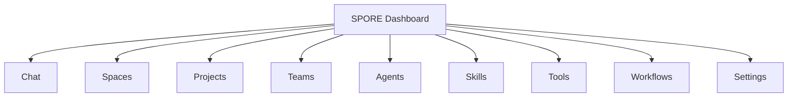
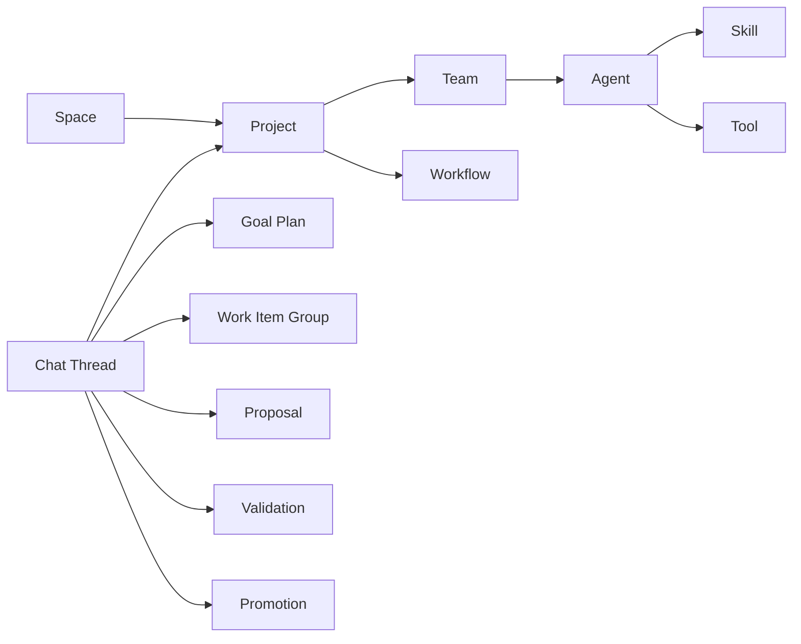
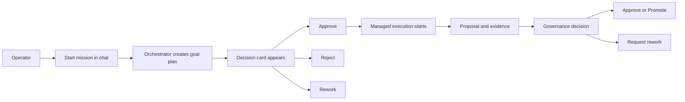

# SPORE Dashboard Master Prompt For Lovable

Use this as the single source prompt for Lovable to design the new SPORE dashboard.

```md
Build a new dashboard for SPORE.

SPORE means: Swarm Protocol for Orchestration, Rituals & Execution.

This is not a generic admin panel and not a simple AI chat app. It is a control plane for a governed multi-agent software delivery system. The dashboard must help an operator understand, supervise, steer, approve, reject, inspect, and configure the whole system from one place.

The current dashboard is only a rough example and is not user-friendly enough. Redesign it from scratch as a polished, serious, operator-grade product.

Your output should feel like mission control for a live orchestration platform.

## What Lovable Should Build

Create a complete dashboard concept and starter UI for SPORE with:

1. a persistent left sidebar,
2. a conversation-first home page called `Chat`,
3. dedicated management pages for core system entities,
4. a coherent visual system,
5. responsive behavior for desktop and mobile,
6. realistic placeholder data so the experience feels complete.

Prioritize desktop, but make mobile usable for reading updates, navigating key pages, and making approvals/rejections.

## Product Context

SPORE is a modular, documentation-first orchestration platform for supervised multi-agent software delivery and self-build workflows.

Important architectural truth:

- the orchestrator is the source of truth for workflow and operator-facing state,
- durable artifacts remain authoritative,
- the UI is a thin control surface over orchestrator-owned data,
- the frontend must not invent its own hidden workflow state machine.

The system includes concepts like:

- operator threads,
- chat messages,
- pending actions,
- governance decisions,
- goal plans,
- work-item groups,
- work items,
- work-item runs,
- proposal artifacts,
- validation results,
- promotions,
- spaces,
- projects,
- teams,
- agents,
- skills,
- tools,
- workflows,
- settings.

The dashboard should make these concepts understandable to a human operator.

## Core Goal

Design a dashboard that allows the operator to control the whole SPORE system.

The most important page is the chat with the orchestrator.

That chat is the first page, the home page, and the primary operating surface.

The orchestrator behaves like the central manager of all projects and workflows in the system. The chat must therefore feel:

- simple,
- clear,
- pleasant,
- readable,
- calm,
- trustworthy,
- action-oriented.

## Top-Level Navigation

The left sidebar must contain these sections:

- Chat
- Spaces
- Projects
- Teams
- Agents
- Skills
- Tools
- Workflows
- Settings

You can add useful sub-navigation inside pages, but these must be the main sections.

## Visual And UX Direction

Design this as a serious operational product, not a toy AI demo.

The visual language should be:

- modern,
- polished,
- structured,
- calm under dense information,
- high-clarity,
- strong in hierarchy and spacing,
- excellent in button affordance and status readability.

Avoid:

- generic chatbot styling,
- purple-on-white AI demo aesthetics,
- cluttered enterprise ugliness,
- flashy marketing-site visuals,
- ambiguous destructive actions,
- bland template dashboards.

The design should feel intentional and premium.

## Global App Shell

Use this shell structure:

- far left: persistent sidebar,
- top of page: contextual page header,
- center: main page content,
- optional right rail: inspector, linked artifacts, pending actions, or context.

Include in the shell:

- search or command palette,
- inbox / pending decision count,
- operator identity area,
- environment or system context indicator.

## Main UX Model

This should be a control-plane dashboard with chat as the operational center.

Think of it as:

- chat for live system control,
- management pages for durable entities,
- clear connections between pages so the operator never loses context.

## Page 1: Chat / Mission Control

This is the home page and the most important screen in the product.

### Chat Purpose

The operator uses this page to:

- start a mission,
- review orchestrator output,
- see what requires attention,
- inspect related records,
- approve or reject decisions,
- request rework,
- continue the conversation naturally.

### Chat Layout

Design a 3-panel desktop layout:

1. Left panel: thread list / mission list
2. Center panel: active mission timeline
3. Right panel: context rail with pending actions and linked artifacts

### Chat Must Include

- thread search,
- thread list with status badges and unread changes,
- active mission header,
- hero card summarizing current mission state,
- progress strip showing workflow/governance stage,
- conversation timeline,
- embedded structured cards from the orchestrator,
- pending decision cards,
- large quick-action buttons,
- composer for sending messages,
- linked artifact/context area.

### Message Types To Support

The orchestrator must be able to send rich, structured cards in the conversation, not plain text dumps.

Support cards such as:

- Goal
- Proposal
- Approval request
- Rejection / rework note
- Validation result
- Workflow status
- Warning
- Blocker
- Next action recommendation
- Project reference
- Team reference
- Agent reference
- Artifact reference

These cards should be visually distinct and easy to scan.

### Required Action Buttons

The interface must prominently support buttons like:

- Approve
- Reject

Also design for:

- Rework
- Hold
- Resume
- Promote
- Quarantine
- Release
- Open Details

These actions should be obvious and easy to click.

### Chat Behavior Principles

- The chat is not just messaging; it is an operating surface.
- The orchestrator should feel like a system controller, not a toy assistant.
- The UI should separate conversation, decisions, evidence, and linked records.
- It should be possible to understand at a glance:
  - what is happening now,
  - what needs attention,
  - what decision is pending,
  - what artifacts are affected,
  - what happens next.

### Chat Desktop Wireframe

```text
------------------------------------------------------------------------------------------------------
| Header: Chat / Mission Control         [Global Inbox] [New Mission] [Filters]                       |
|----------------------------------------------------------------------------------------------------|
| Thread List                    | Active Mission Timeline                         | Context Rail      |
|-------------------------------|-------------------------------------------------|------------------|
| Search threads                | Mission title                                   | Current state     |
| Inbox summary                 | Mission subtitle / project / space              | Pending actions   |
| Thread item                   |-------------------------------------------------| Linked artifacts  |
| Thread item                   | Hero card                                       | Goal plan         |
| Thread item                   | Progress strip                                  | Proposal          |
| Thread item                   |-------------------------------------------------| Validation        |
| Thread item                   | Message timeline                                | Project           |
|                               | - operator message                              | Workflow          |
|                               | - orchestrator rich card                        | Agent/team refs   |
|                               | - decision card with buttons                    | Activity summary  |
|                               | - evidence / warning / blocker card             |                  |
|                               |                                                 |                  |
|                               | Composer [message input......................]   |                  |
|                               | [Approve] [Reject] [Rework] [Hold] [Send]       |                  |
------------------------------------------------------------------------------------------------------
```

### Chat Mobile Behavior

- thread list becomes a slide-over panel,
- context rail becomes a tab, drawer, or bottom sheet,
- active decision actions remain easy to reach,
- the operator must still be able to approve or reject quickly.

## Page 2: Spaces

Spaces are top-level containers.

One space can contain one project or multiple projects.

The UI must support:

- creating a space,
- editing a space,
- deleting a space,
- browsing all projects inside the space,
- seeing high-level status for the space.

### Spaces Layout

- summary cards at the top,
- list or grid of spaces,
- each space card shows name, description, project count, activity, status,
- quick actions: open, edit, delete.

## Page 3: Projects

Projects represent repositories or managed delivery contexts where SPORE operates.

Projects belong to spaces.

The UI must support:

- adding projects,
- removing projects,
- assigning a project to a space,
- viewing repository metadata,
- connecting teams to projects,
- connecting workflows to projects,
- understanding current orchestrator activity for that project.

### Project Detail Sections

- Overview
- Teams
- Workflows
- Activity
- Governance

### Important Project Signals

Show things like:

- linked space,
- repository,
- active workflows,
- teams attached,
- pending approvals,
- recent proposals,
- current status.

## Page 4: Teams

Teams are groups of agents that can be attached to projects.

The UI must support:

- creating teams,
- naming teams,
- describing team purpose,
- assigning agents,
- defining responsibilities,
- attaching teams to projects.

### Team Detail Should Show

- purpose,
- roster of agents,
- responsibility matrix,
- linked projects,
- linked workflows if relevant.

## Page 5: Agents

Agents are configurable system actors.

The UI must support:

- creating agents,
- naming agents,
- adding descriptions,
- assigning skills,
- assigning tools,
- inspecting intended use,
- connecting agents to teams.

### Agent Detail Should Show

- name,
- description,
- assigned skills,
- assigned tools,
- team membership,
- permissions / guardrails summary,
- where the agent is used.

## Page 6: Skills

Skills are reusable capabilities that can be assigned to agents.

The UI must support:

- browsing skills,
- understanding what each skill does,
- seeing which agents use it,
- seeing indirect team usage.

## Page 7: Tools

Tools are executable capabilities available to agents.

The UI must support:

- browsing tools,
- understanding purpose,
- understanding restrictions or risk,
- seeing which agents use each tool.

## Page 8: Workflows

Workflows define how work and communication move through the system.

The UI must support:

- listing workflows,
- viewing workflow details,
- understanding stage order,
- understanding handoffs,
- seeing linked projects,
- seeing linked teams or participating roles,
- understanding workflow structure visually.

### Workflow Page Must Include

- workflow list,
- workflow detail,
- stage breakdown,
- visual flow map,
- linked projects,
- linked teams or roles,
- status or usage summary.

## Page 9: Settings

Settings should be system-wide, not random page preferences.

Organize Settings into clear groups such as:

- General
- Orchestrator
- Governance
- Validation
- Promotion
- Notifications
- Environments
- Security / Safety
- Observability
- Interface Preferences

Do not turn Settings into a junk drawer.

## Required Relationships To Make Visible

The dashboard must make these relationships obvious:

- Space -> Projects
- Project -> Teams
- Team -> Agents
- Agent -> Skills
- Agent -> Tools
- Project -> Workflows
- Workflow -> participating roles / agents / teams
- Chat thread -> related project / decisions / artifacts

An operator should be able to navigate through these relationships easily.

## Shared Components To Design

Create a consistent component system including:

- app sidebar,
- page header,
- summary cards,
- status badges,
- health badges,
- thread rows,
- message bubbles,
- orchestrator structured cards,
- decision cards,
- artifact cards,
- context rail modules,
- tables or grids,
- multi-select assignment controls,
- confirmation dialogs,
- activity timelines,
- workflow map blocks.

## State Semantics

The UI should make these distinctions clear:

- conversation state,
- durable system records,
- execution state,
- governance state,
- configuration state.

Examples of clear operator-facing statuses:

- Needs Review
- Needs Approval
- Running
- Held
- Blocked
- Validation Pending
- Promotion Ready
- Promotion Blocked
- Completed
- Rejected

Avoid vague labels.

## Thin-Client Rule

Assume the backend/orchestrator provides authoritative data like:

- thread summaries,
- inbox summaries,
- decision guidance,
- progress projections,
- evidence summaries,
- status badges,
- action choices,
- artifact references,
- queue summaries.

Design the frontend to render this cleanly and beautifully.

Do not design the frontend as if it computes workflow truth by itself.

## Non-Goals

Do not:

- build a bland generic admin dashboard,
- build only a chat screen,
- make it feel like a toy chatbot,
- invent backend workflow logic in the UI,
- hide important actions behind tiny menus,
- overload everything into dense tables.

## Important Implementation Guidance For Lovable

- Build a realistic starter UI with polished mock data.
- Make the `Chat` page the first screen and the strongest screen.
- Ensure all navigation items have corresponding pages or clear shells.
- Use a consistent design system across all pages.
- Make relationships between entities visible in the UI.
- Favor cards, panels, and strong hierarchy over raw database-looking tables.
- Keep action buttons highly usable.
- Make sure the design is responsive.

## Expected Output

Produce a complete starter dashboard experience for SPORE that includes:

1. the global dashboard shell,
2. the full sidebar,
3. the `Chat / Mission Control` home page,
4. supporting pages for `Spaces`, `Projects`, `Teams`, `Agents`, `Skills`, `Tools`, `Workflows`, and `Settings`,
5. realistic data examples,
6. coherent navigation between pages,
7. a visually polished and operationally credible interface.

## Mermaid: Navigation



## Mermaid: Relationships



## Mermaid: Mission Control Flow



Final instruction: build the first serious, polished dashboard for SPORE. The home page is orchestrator chat, but the product as a whole is a system control plane for spaces, projects, teams, agents, skills, tools, workflows, and settings.
```

## Notes

- This file merges the intent from `docs/dashboard-rebuild-agent-prompt.md` and `docs/dashboard-wireframe-spec.md` into one Lovable-friendly brief.
- It is written to be self-contained, so it can be pasted directly into Lovable.
